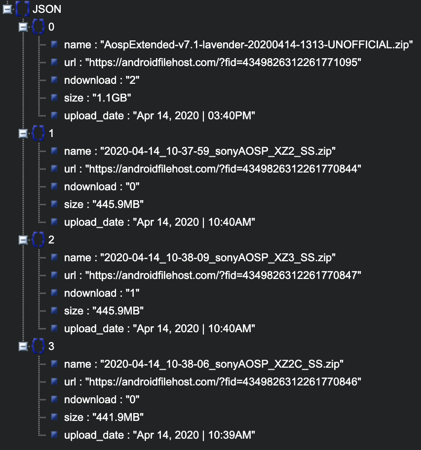

# AFHSearch API

[](https://paypal.me/fast0n)  [](https://github.com/Fast0n/afhsearch-api/blob/master/LICENSE) [](https://travis-ci.org/Fast0n/afhsearch-api)

## Methods

#### search

Search files - devices - developers on Androidfilehost.com

Parameters:

- search [required] - the name of the files/devices/developers
- type [required] - The value field may specify one of the following strings: FILES, DEVICES, DEVELOPERS

Example Usage:

```
afhsearch-api.herokuapp.com/?search=aosp&type=files
```

Returns
The standard JSON array

#### files

- name
- url
- ndownload
- size
- upload_date

#### devices

- name
- codename
- url

#### developers

- name
- url

# Result

